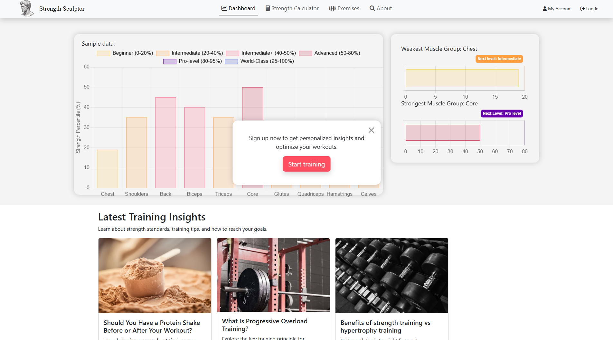

# StrengthSculptor.com

## Overview

StrengthSculptor is a full-stack strength tracking web application that calculates strength standards and percentiles based on user input and stored workout data.

Users can analyze individual exercises, track progress over time, and visualize overall strength development across muscle groups through dynamic data visualization.

StrengthSculptor was built as a practical tool I personally use to track and analyze my strength progression, with data-driven insights and muscle group analytics.

---

  
  
  

---

## Core Features

### Strength Calculator
- Select gender, bodyweight, exercise, weight lifted, and reps.
- Calculates strength standards for that exercise.
- Computes user strength percentile relative to standardized data.

---

### 📊 Personalized Dashboard (Authenticated Users)
- Stores user exercise data securely.
- Aggregates performance across all saved exercises.
- Generates a dynamic bar chart analyzing strength by muscle group.
- Highlights:
  - Weakest muscle groups
  - Strongest muscle groups
  - Overall performance balance

---

### 📚 Exercise Library
- Browse different exercises.
- View exercise instructions and details.
- See personal performance data per exercise.

---

### 📰 News Section
- Displays strength / fitness-related updates.
- Provides dynamic content separate from the tracking system.

---

### 🔐 Authentication & Security
- User registration and login system.
- Passwords are hashed before storage.
- Secure session handling.
- Data tied to authenticated users only.

---

## 🛠 Tech Stack

**Frontend**
- HTML
- CSS
- Bootstrap
- JavaScript

**Backend**
- Node.js
- Express.js

**Database**
- PostgreSQL
- Hosted on Render

**Deployment**
- Hosted on Render
- Private GitHub repository for source control
- Database hosted alongside backend on Render

---

## 🏗 Architecture Overview
Client (Browser) -> Express Server (Node.js) -> PostgreSQL database

- The frontend sends requests to the Express API.
- The backend processes authentication and strength calculations.
- User data is stored securely in PostgreSQL.
- Dashboard dynamically visualizes aggregated strength data.

---
